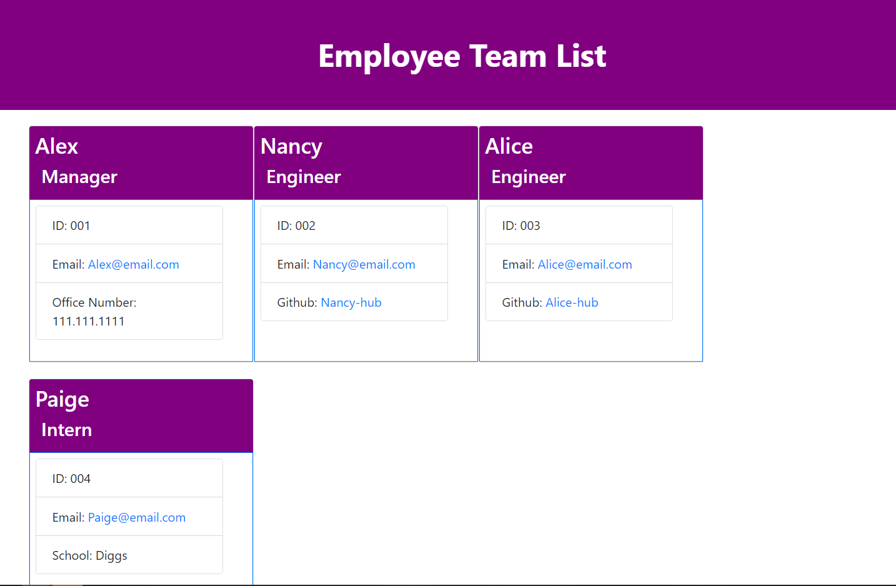

# Team Profile Generator

## Description

This tool allows users to create a team profile. By using Inquirer, users will be prompted to enter employee details (E.G., Role, Name, Employee ID, Office Number, GitHub, School). After completion, the application will generate an HTML file, Assets/CSS folder, and a Styles file.

## Demo

## Built With

   

## Table of Contents

- [Installation](#Installation)
- [Usage](#Usage)
- [License](#License)
- [Questions](#Questions)

## Installation

run `npm install` before application

## Usage

See description above.

## License

## Questions

All questions maybe directed to the contact information listed below.

Github: Charlton-H
Email: Charlton@email.com

### &copy; 2022 Charlton Hua
